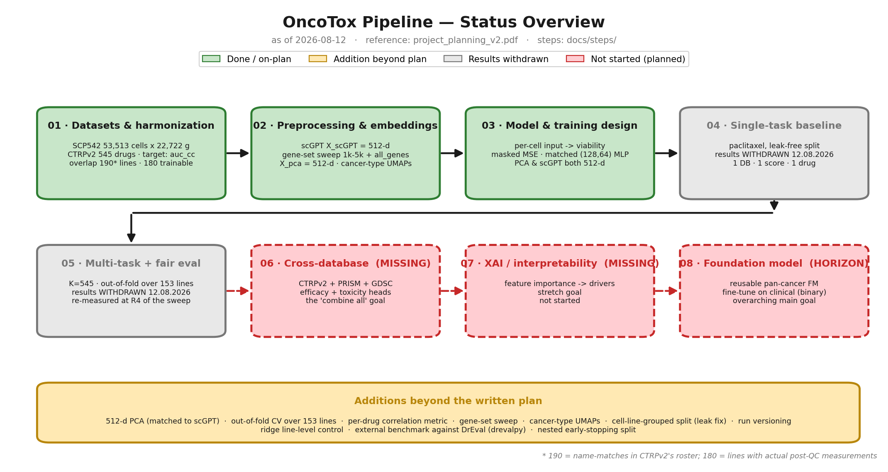

# OncoTox

Predicting pharmacological response (drug efficacy/toxicity) from single-cell RNA-seq by
mapping bulk CTRPv2 dose-response labels onto SCP542 cells, using **scGPT** foundation-model
embeddings as a denoised biological prior and comparing against a PCA baseline.

## Documentation

All project documentation lives in [`docs/`](docs/):

- **[docs/project_progress.md](docs/project_progress.md)** — the source of truth: an index
  (pipeline overview, full project arc, current-status scorecard, doc conventions) linking to
  thematic step files under [`docs/steps/`](docs/steps/) that hold the complete record of every
  step, number, parameter, and result, with alignment notes against the project plan. Start here.
- **[docs/steps/](docs/steps/)** — the step files covering the project end-to-end: `01`–`05` are the
  scientific record of what currently holds, [`06-planned-work.md`](docs/steps/06-planned-work.md)
  holds the three unstarted stages, and
  [`corrections-and-dead-ends.md`](docs/steps/corrections-and-dead-ends.md) holds everything
  superseded, retracted or abandoned — nothing in it is a live result.
- **[docs/TODO.md](docs/TODO.md)** — what is next and what blocks it. Read its banner first.

### Status against the plan



All figures live in [docs/figures/](docs/figures/) and are built with `uv run docs/make_figures.py`.

⛔ **The pipeline diagram is archived, not shown.** It, along with `model_architecture.png`,
`loss_02_weights.png` and `loss_03_effect.png`, is derived from the targets h5ad or from a training
run — and neither exists on the current target, since preprocessing has not re-run under the
[freeze](docs/TODO.md) and the last training run used the void 8-drug panel. They are **not** built
from the retired `auc` h5ad still on disk: a figure that can only be produced from a target the
pipeline no longer writes is not reproducible by a standard run. `make_figures.py` skips each with a
reason and they return by themselves at R4 — see
[`docs/figures/archive/`](docs/figures/archive/).

## Layout

```
scripts/layout.py        # path contract: data roots, variants, derived filenames (used by every stage)
scripts/sources/         # retrieval from external services: CTRPv2, Sun 2017 table, PubChem, Cellosaurus
scripts/annotation/      # identifier resolution: compound join (drug_annotation), HGNC symbols
scripts/preprocessing/   # SCP542 conversion, CTRP target mapping, splits, PCA, orchestrator
scripts/model/           # OncoMLP + datasets
scripts/training/        # train_multitask.py + shared training utils / run versioning
scripts/evaluation/      # DrEval normalization (paper protocol only)
notebooks/               # overlap audit (compare_GDSC_CTRP), variant checks & UMAPs (verify_variants), drug coverage (drug_coverage)
runs/                    # per-run artifacts + runs_index.csv (gitignored)
docs/                    # TODO.md, project_progress.md (index) + steps/ (01-06, corrections), figures
```

## Quickstart

```bash
# Preprocess (HVG-5000 variant, all CTRPv2 drugs; skips the external scGPT step if embeddings exist).
# --score picks the CTRPv2 response target: auc_cc (default, DrEval's CurveCurator AUC) or ln_ic50_cc.
# Each score writes its own targets h5ad.
uv run scripts/preprocessing/run_preprocessing.py --variant hvg5000 \
    --start-at targets --skip-scgpt --all-drugs

# Train multi-task (all 545 CTRPv2 drugs).
uv run scripts/training/train_multitask.py --use-rep X_scGPT   # scGPT embeddings
uv run scripts/training/train_multitask.py --use-rep X_pca     # PCA baseline
```

See [docs/project_progress.md](docs/project_progress.md) for full commands, data layout, and results.
