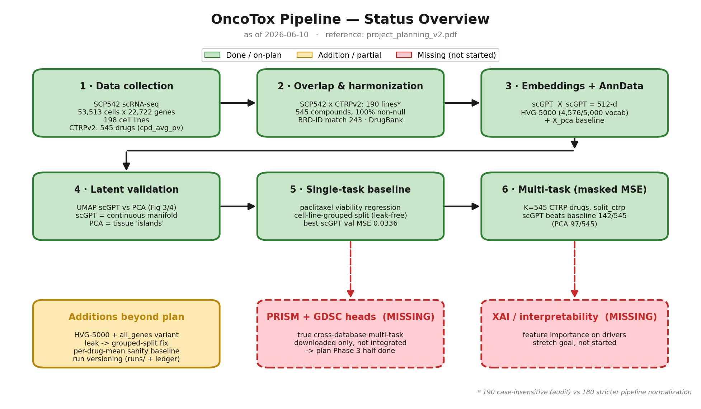

# OncoTox — Project Progress

*Self-contained chronological record of everything done so far, with all key numbers,
parameters, and results. This file is the source of truth — everything should be
derivable from it. `project_notes.md` is a complementary thought/decision log.*

Reference plan: `~/Desktop/OncoTox/project_plan/project_planning_v2.pdf`.
Plan-alignment is marked **✅ on-plan** or **⚠️ deviation/addition** throughout.

---

## Pipeline overview (at a glance)



Green = done / on-plan · amber = addition or partial · red (dashed) = still missing.
Stages 1–6 below are complete; the two red boxes (cross-database PRISM/GDSC heads and the
XAI stretch goal) are the remaining work. Regenerate with
`uv run docs/make_pipeline_overview.py` (source: `docs/make_pipeline_overview.py`).

---

## 0. The plan (for reference)

A staged prototype:

1. **Latent-space validation** — generate scGPT embeddings, compare to full-transcriptome
   PCA via UMAP (Fig. 3 by cancer type, Fig. 4 by paclitaxel viability); confirm scGPT
   removes tissue-of-origin bias.
2. **Single-task baseline** — regress the continuous CTRPv2 `cpd_avg_pv` (viability)
   score from the embeddings on the **highest-confidence intersection** SCP542×CTRPv2
   (**190 cell lines, 545 compounds, 100 % non-null in overlap**). *Do not start
   multi-task / PRISM / GDSC until this works.*
3. **Iterate outward** — add masked-loss multi-task and integrate the larger, sparser
   PRISM (and GDSC) datasets.
4. **Stretch goal** — XAI / feature importance.

**Core hypothesis:** scGPT embeddings are a denoised biological prior that forces the
regressor to learn real resistance signatures instead of memorizing cell line / tissue
identity → should show as **less overfitting (smaller train/val gap) for scGPT than PCA**.

---

## 1. Data collection (26.03–30.03.2026)

| Dataset | Role | Key numbers | Used? |
|---|---|---|---|
| **SCP542** scRNA-seq (PERCEPTION paper, Kinker et al. 2020) | single-cell input | **53,513 cells × 22,722 genes**, **198 unique cell lines** | ✅ primary |
| **CTRPv2** | viability labels | 1,107 cell lines, **545 compounds**, target `cpd_avg_pv` | ✅ primary |
| **PRISM** Repurposing (Public 24Q2) | single-dose LFC | 915 cell lines, 6,575 compounds | downloaded, not used |
| **GDSC2** | IC50 / AUC | 967 cell lines, 295 drugs | downloaded, not used |

- SCP542 source: SCP542 / Broad Single Cell Portal; `.X` stored as **CPM**.
- CTRPv2 raw tables used: `v20.data.per_cpd_post_qc.txt` (`cpd_avg_pv`),
  `v20.meta.per_experiment.txt`, `v20.meta.per_cell_line.txt`, `v20.meta.per_compound.txt`.

✅ On-plan: SCP542 + CTRPv2 are the designated primary pair; PRISM/GDSC reserved for later.

---

## 2. Overlap & coverage audit (03.04.2026) — `notebooks/compare_GDSC_CTRP.ipynb`

The work behind the plan's **Fig. 1 / Fig. 2**.

**Cell-line overlap with SCP542** (normalized: trim + lowercase; SCP542/PRISM split on `_`):

| Dataset | Total lines | Overlap w/ SCP542 | Missing |
|---|---|---|---|
| GDSC | 967 | 133 | 65 |
| CTRPv2 | 1,107 | **190** | 8 |
| PRISM | 915 | 182 | 16 |

**Drug / compound harmonization** — unified catalog `data/drug/all_sources_drug_catalog.csv`
(7,415 source rows; GDSC 295 / CTRPv2 545 / PRISM 6,575; union 7,040):

- Name overlap (normalized): CTRPv2↔GDSC 66, CTRPv2↔PRISM 218, GDSC↔PRISM 144.
- **BRD-ID overlap CTRPv2↔PRISM: 243** (higher-confidence link).
- Exports: `data/drug/drug_overlap_candidates.csv`.

**DrugBank match** (from `full database.xml`, normalized names + synonyms):
GDSC 118/295 (40.0 %), CTRPv2 173/545 (31.7 %), PRISM 3,483/6,575 (53.0 %),
overall 3,774/7,415 (50.9 %). Exports: `drugbank_overlap_matches.csv`, `..._unmatched.csv`.

**Applicable (non-null) response coverage within SCP542 overlap:**

| Dataset | Metric | Non-null / total | % | % within overlap subset |
|---|---|---|---|---|
| GDSC | `LN_IC50` | 8,007 / 242,036 | 3.31 % | 100 % |
| CTRPv2 | `cpd_avg_pv` | 1,521,028 / 7,227,951 | 21.04 % | **100 %** |
| PRISM | extended primary matrix | 1,210,432 / 4,213,048 | 28.73 % | 97.95 % |

✅ On-plan: satisfies sub-goal 1 (harmonization incl. BRD + DrugBank) and supplies the
Fig. 1/2 numbers the plan rests sub-goal 3 on.

> ⚠️ **Number to reconcile:** this audit reports **190** overlapping cell lines
> (case-insensitive). The training pipeline (`ctrp_to_h5ad.py`) normalizes more strictly
> (also strips `-`) and reports **180** at run time (§6). Same data, different
> normalization — pick one for the thesis figure and the pipeline.

---

## 3. Build the AnnData + latent-space validation (21.04–07.05.2026)

Pipeline scripts, in order:

1. **`scp542_conversion.py`** — read raw `CPM_data.txt` (genes × cells) + `Metadata.txt`,
   transpose to cells × genes, align metadata → **`SCP542_CCLE.h5ad`** (53,513 × 22,722,
   `.X` = CPM, no gene filter at this stage).
2. **scGPT embedding** — external `gen_embeds.py` (separate scGPT venv) using the
   `scGPT_human` weights → `SCP542_CCLE_scGPT_human_embeddings.h5ad` with
   **`obsm["X_scGPT"]` = 512-dim** per cell.
3. **`ctrp_to_h5ad.py`** — merge the 4 CTRPv2 tables, aggregate `cpd_avg_pv` to one value
   per (cell line, drug), map onto matching cells → `..._with_targets.h5ad`.
4. **UMAP validation** — `notebooks/scgpt_umap.ipynb`: standard PCA vs scGPT UMAP, colored
   by cancer type (**Fig. 3**) and by paclitaxel viability (**Fig. 4**).

✅ On-plan and in the right order: embeddings + comparative UMAP came before any predictor,
and visually confirmed the hypothesis (PCA = discrete tissue "islands", scGPT = continuous
shared manifold; paclitaxel sensitivity mixed on the scGPT manifold).

---

## 4. Single-task paclitaxel baseline + data-leak fix (08.05.2026)

Target endpoint: per-cell **paclitaxel viability** (`viability_paclitaxel`), i.e. the bulk
`cpd_avg_pv` broadcast to every cell of the matching cell line.

- Total cells **53,513**; cells with a valid paclitaxel label **44,367**.

**Step 1 — random 70/15/15 split (the deliberate mistake):** `split_paclitaxel` →
train 31,056 / val 6,655 / test 6,656 / unassigned 9,146.

- scGPT: train MSE 0.0132 / val 0.0137
- PCA: train MSE 0.0022 / **val 0.0011** ← implausibly good

→ **Data leakage**: cells of the same cell line in both train and val; PCA memorized the
tissue island + its bulk label.

**Step 2 — cell-line-grouped split** (`create_splits.py`, sklearn `train_test_split`,
`random_state=42`, group = `Cell_line`; 70/15/15 = test_size 0.30 then 0.50):

- **170 cell lines with paclitaxel labels → 119 train / 25 val / 26 test**
- Cells: **train 31,824 / val 5,035 / test 7,508 / unassigned 9,146**
- Re-trained unregularized (old 256-dim MLP): scGPT val 0.0437, PCA val 0.0390 → PCA's
  generalization collapsed, confirming prior cheating.

**Step 3 — aggressive regularization** (hidden 256→64, dropout 0.3→0.5, weight_decay
1e-5→1e-3):

| Model | Train MSE (ep 50) | Val MSE | Train/val gap |
|---|---|---|---|
| scGPT | 0.0260 | ~0.0371 (ep 10) | **≈ 0.013** |
| PCA | 0.0082 | ~0.0380 (ep 10) | **≈ 0.029** |

✅ On-plan + **core hypothesis confirmed**: near-equal val MSE, but scGPT overfits far less
— exactly the Fig. 4 prediction that PCA cheats by classifying cell line.

> ⚠️ **Addition (good practice):** the random-split → leak-diagnosis → grouped-split arc
> isn't written in the plan, but it's the "find failures cheaply, document even suboptimal
> versions" discipline the plan asks for. Worth keeping as a result.

---

## 5. Pipeline orchestrator + HVG-5000 + model/training upgrade (25.05.2026)

**Orchestrator** `scripts/preprocessing/run_preprocessing.py` runs 5 steps in order:
`convert → scgpt → targets → splits → pca`. Paths derived once from `(data_root, variant)`
in `layout.py`; outputs live under `processed/scRNAseq_SCP542/<variant>/`. Expensive steps
refuse to overwrite without `--overwrite`; `hvg5000` and `all_genes` never share a folder.

**HVG-5000 filtering** (`scp542_conversion.py`): on a `log1p` **copy**, run
`sc.pp.highly_variable_genes(n_top_genes=5000, flavor="seurat")`, subset the **original CPM**
matrix to the selected genes (saved `.X` stays CPM), record `uns["hvg_n_top_genes"]=5000`.

**HVG-5000 pipeline outputs:**

- Genes: **22,722 → 5,000**
- scGPT vocab match: **4,576 / 5,000** (424 OOV)
- Embedded AnnData: 53,513 × 5,000
- Paclitaxel labels: 44,367 / 53,513 cells
- `split_paclitaxel`: train **31,824** / val **5,035** / test **7,508** / unassigned **9,146**

**Model upgrade** (`scripts/model/OncoMLP.py`): default **LayerNorm + GELU**, input dropout
0.1, configurable `hidden_dims` — **(64,32) for PCA, (128,64) for scGPT**.
**Training upgrade** (`scripts/training/training_utils.py`): seeded (seed 42), Adam,
**ReduceLROnPlateau** (factor 0.5, patience 3), **gradient clipping** (max-norm 1.0),
**early stopping** (patience 10), best-val checkpoint restore, masked-loss support.

**Paclitaxel single-task results — progression of best val MSE:**

| Setup | PCA best val | scGPT best val |
|---|---|---|
| No-HVG, regularized (08.05) | ~0.0375 (ep 10) | ~0.0371 (ep 10) |
| HVG-5000, old model (BatchNorm/ReLU) | 0.0362 (ep 5) | 0.0354 (ep 50) |
| **HVG-5000, upgraded model** | **0.0351 (ep 8)** | **0.0336 (ep 14)** |

These are the **single-task reference points** (`split_paclitaxel`, 5,035 val cells).

✅ On-plan (still single-task CTRPv2 viability on the overlap; best result to date).

> ⚠️ **Addition:** the plan only mentions full-transcriptome PCA; HVG-5000 (5,000-gene
> reduction) is a new variant — fewer scGPT OOV genes, smaller files. Justify it against
> the full-transcriptome path (the `all_genes` variant in §7 exists for this comparison).

---

## 6. Multi-task masked loss over all 545 CTRPv2 drugs (26.05.2026)

Moves from plan-Phase-2 (single-task) into plan-Phase-3 (masked-loss multi-task).

**New target artifacts written by `ctrp_to_h5ad.py`:**

- `obsm["Y_ctrp"]` — float32 (n_cells, K), per-cell viability, NaN where missing.
- `obsm["M_ctrp"]` — bool (n_cells, K), True where observed.
- `uns["ctrp_drugs"]` — ordered length-K drug-name list (column order of Y/M).
- `obs["split_ctrp"]` — **one drug-agnostic, cell-line-grouped 70/15/15 split** shared
  across all heads (leakage-free for every drug simultaneously).
- Legacy flat `viability_<drug>` / `train_mask_<drug>` / `split_<drug>` kept for back-compat.

**Drug-scope filter:** keep a drug only if screened on ≥ `--min-cell-lines` overlapping
cell lines (default 50). This run used **`--all-drugs` (= min 0) → K = 545 drugs**.

**Run-time overlap reported by the pipeline:** **180 / 198** SCP542 cell lines overlap
CTRPv2 (the stricter-normalization 180; cf. audit's 190 in §2).

**`split_ctrp` distribution (shared by all four runs below):**

- Cells: **train 34,126 / val 7,121 / test 5,980 / unassigned 6,286**
- Cell lines: **126 train / 27 val / 27 test**

**Model & training:** single `OncoMLP` with `output_dim = K`; `train_model` auto-detects
3-tuple `(x, y, mask)` batches → **masked MSE** (mean over observed entries only). A
**per-drug-mean sanity baseline** (predict train-set mean viability per head) is computed
up front — any head the model can't beat hasn't learned anything.

**Shared hyperparameters** (from `config.json` / `run_meta.json`): batch 128, epochs 50
(early-stopped), lr 1e-3, weight_decay 1e-3, dropout 0.5, input_dropout 0.1, grad_clip 1.0,
scheduler patience 3, early-stop patience 10, seed 42, loss MSE, norm LayerNorm.
scGPT input_dim **512** / hidden (128,64); PCA input_dim per `X_pca` / hidden (64,32).

**The four runs (all share `split_ctrp`; n_train 34,126 / n_val 7,121):**

| Run id | Rep | K | Best epoch | Best val MSE | Baseline mean MSE | Model mean MSE | Heads beat baseline |
|---|---|---|---|---|---|---|---|
| `20260526_132914_multitask_X_scGPT_subset_K1` | X_scGPT | 1 (paclitaxel) | 11 | 0.0412 | 0.0434 | 0.0412 | 1 / 1 |
| `20260526_132952_multitask_X_pca_subset_K1` | X_pca | 1 (paclitaxel) | 5 | 0.0393 | 0.0434 | 0.0393 | 1 / 1 |
| `20260526_133012_multitask_X_scGPT_all_drugs` | X_scGPT | 545 | 7 | 0.0105 | 0.0097 | 0.0103 | **142 / 545** |
| `20260526_133112_multitask_X_pca_all_drugs` | X_pca | 545 | 6 | 0.0112 | 0.0097 | 0.0114 | 97 / 545 |

**Reading the results:**

- The K=545 ~0.0105 looks good **only because most viability values sit near 1.0**, so the
  per-drug-mean baseline is already 0.0097. The honest metric is **heads-beating-baseline**:
  **scGPT 142/545 vs PCA 97/545** — scGPT wins on ~47 % more heads at the same K and split.
- Worst heads (model < baseline) are the lowest-coverage ones (n_val = 221): `brd-k30748066`,
  `vx-680`, `brd-k33514849`, `brd9876:mk-1775 (4:1 mol/mol)`, `bafilomycin a1` — candidates
  to drop or down-weight.
- Largest single win in both reps: `gsk-j4` (model ≈ 0.000 vs baseline 0.011, n = 221) —
  sanity check that a head can fit a low-variance drug-line combination.

✅ On-plan: masked-loss multi-task, correctly gated behind a working single-task baseline,
with the cheap sanity baseline the plan's prototyping section calls for.

> ⚠️ **Key deviation — what "multi-task" means today:** the plan frames multi-task as
> **cross-database** (CTRPv2 + PRISM + GDSC heads). What's built is multi-task **across the
> 545 drugs of one database (CTRPv2)**. A legitimate *intermediate* step that validates the
> masked-loss machinery — but PRISM/GDSC are **not yet integrated**, so plan-Phase-3 is only
> half done. Don't read the 545-head run as "the multi-task goal is complete."

> ⚠️ **Not comparable:** the K=1 paclitaxel numbers here (val 0.0412 scGPT / 0.0393 PCA on
> `split_ctrp`, 27 held-out lines) are **not** comparable to the 25.05 single-task numbers
> (0.0336 / 0.0351 on `split_paclitaxel`, different held-out lines). An apples-to-apples
> "does multi-task help paclitaxel?" comparison still needs a single-task re-run on `split_ctrp`.

> ⚠️ **Provenance:** these four `run_meta.json` files record the targets h5ad at the **old
> flat path** `data/scRNAseq_SCP542/metadata/…_with_targets.h5ad`, i.e. they predate the
> variant-based `processed/<variant>/` layout refactor (commit `900abe6`). Re-running under
> `processed/hvg5000/` should reproduce them but hasn't been done.

---

## 7. Run versioning + `all_genes` variant (26.05.2026)

**Run versioning** (`training_utils.create_run_dir` / `save_run`): every
`train_multitask.py` run writes a self-contained `runs/<timestamp>_<tag>/`:

- `config.json` — exact `TrainConfig`.
- `run_meta.json` — scope, rep, dataset sizes, hidden_dims, host/python/torch info, drug list.
- `history.csv` — epoch, train_mse, val_mse, lr.
- `summary.json` — best_val_mse, best_epoch, baseline-vs-model mean MSE, heads-beating count.
- `best_model.pt` — best-val-MSE state_dict.
- `per_drug_results.csv` — drug, model_val_mse, baseline_val_mse, delta, n_val.

Plus one row per run in `runs/runs_index.csv` (columns: run_id, tag, scope, rep, K,
n_train_cells, n_val_cells, best_epoch, best_val_mse, baseline_mean_mse, model_mean_mse,
n_beats_baseline, n_total_heads, started_at, finished_at). `runs/` is gitignored.

✅ On-plan: satisfies "retain every working version + data to re-run + results, even
suboptimal ones."

**`all_genes` (full-transcriptome) variant:** the whole pipeline (convert → scGPT → targets)
was regenerated without HVG filtering and now exists on disk under
`processed/scRNAseq_SCP542/all_genes/`. `notebooks/hvg_vs_all_genes_umap.ipynb` compares
HVG-5000 vs all-genes UMAPs. Evaluation of the all-genes side is still pending.

✅ On-plan / closes part of the §5 HVG deviation by enabling the full-transcriptome comparison.

---

## 8. Current data layout (on disk)

`DEFAULT_DATA_ROOT = /Users/selin/Desktop/OncoTox/data`

```
data/
  scRNAseq_SCP542/expression/CPM_data.txt
  scRNAseq_SCP542/metadata/Metadata.txt
  metadata/CTRPv2.0_2015_ctd2_ExpandedDataset/
  drug/                                  # harmonization catalogs + DrugBank exports
  processed/scRNAseq_SCP542/hvg5000/     # default training variant
  processed/scRNAseq_SCP542/all_genes/   # full transcriptome variant
```

Per variant, three h5ad files: `SCP542_CCLE.h5ad` → `..._scGPT_human_embeddings.h5ad`
→ `..._with_targets.h5ad` (the trainable file: `X_scGPT`, `X_pca`, `Y_ctrp`, `M_ctrp`,
`split_ctrp`, `split_paclitaxel`).

**Reproduce end-to-end:**
```bash
# preprocessing (HVG-5000, all CTRPv2 drugs, skip the external scGPT step if embeddings exist)
uv run scripts/preprocessing/run_preprocessing.py --variant hvg5000 --start-at targets --skip-scgpt --all-drugs
# training
uv run scripts/training/train_multitask.py --use-rep X_scGPT            # all 545 drugs
uv run scripts/training/train_multitask.py --use-rep X_pca --drugs paclitaxel  # single-task PCA
```

---

## 9. Scorecard — plan vs. reality

| Plan item | Status | Evidence |
|---|---|---|
| Sub-goal 1: compound harmonization (names + BRD + DrugBank) | ✅ Done | §2; `data/drug/` |
| Sub-goal 2: masked-loss sparsity handling | ✅ Done (intra-CTRPv2) | §6 |
| Sub-goal 3: baseline on SCP542×CTRPv2 highest-confidence intersection | ✅ Done | §4–§6 |
| Phase 1: scGPT embeddings + UMAP latent validation | ✅ Done | §3; Fig. 3/4 |
| Phase 2: single-task continuous `cpd_avg_pv` regression | ✅ Done | best scGPT val **0.0336** (§5) |
| Core hypothesis: scGPT overfits less than PCA | ✅ Confirmed | gap 0.013 vs 0.029 (§4) |
| Phase 3a: multi-task masked loss | ✅ Done **within CTRPv2 only** | §6 |
| Phase 3b: integrate PRISM / GDSC (cross-database) | ❌ Not started | data downloaded only |
| Stretch: XAI / feature importance | ❌ Not started | expected (late-stage) |

**Additions beyond the written plan (all defensible — document them):** random→leak→grouped
split (§4); HVG-5000 + all-genes comparison (§5, §7); per-drug-mean sanity baseline +
run-versioning ledger (§6, §7).

**Two things to flag clearly in the writeup:**

1. **Multi-task today = 545 CTRPv2 drugs, not CTRPv2+PRISM+GDSC** — plan-Phase-3 half done.
2. **Cell-line overlap is quoted as 190 (audit/Fig. 1) vs 180 (pipeline)** — same data,
   different name normalization; pick one and use it consistently.

---

## 10. Open questions carried forward

- Does multi-task help or hurt paclitaxel vs the 0.0336 single-task number? (Needs a
  single-task re-run on `split_ctrp`.)
- Which low-coverage heads (n_val = 221) to drop or down-weight?
- Move loss from uniform-per-entry to per-head / uncertainty weighting?
- Does HVG-5000 lose signal vs the full transcriptome? (Pending the all-genes side of
  `hvg_vs_all_genes_umap.ipynb`.)
- When to integrate PRISM/GDSC as additional masked heads (the true Phase-3)?
