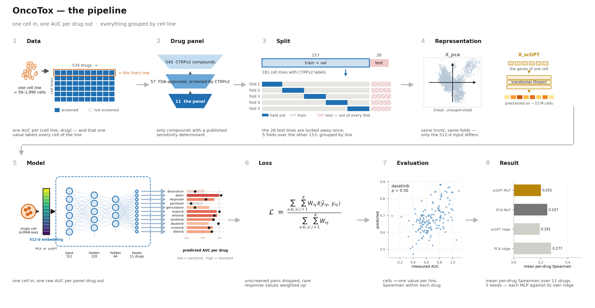

# OncoTox — Project Progress (index)

*Top-level index. The record itself lives in the step files under [`docs/steps/`](./steps/); this page
holds the pipeline overview, the project arc, the status scorecard and the doc conventions — and links
everywhere else. What went wrong is collected in
[Corrections](./steps/corrections-and-dead-ends.md); open work is in [TODO](./TODO.md).*

Reference plan: `~/Desktop/OncoTox/project_plan/project_planning_v2.pdf`.
Plan-alignment is marked **✅ on-plan** or **⚠️ deviation/addition** inside each step file.
A standalone LaTeX write-up of the current state lives in [`../report/`](../report/) (→ `main.pdf`).

> ## ⛔ 28.07.2026 — no number on this page is currently quotable
>
> **The drug panel is void and a full pipeline review is in progress.** The panel's candidate list was
> ranked on our own response values before the literature criterion was applied, so everything computed on
> it is provisional
> ([Corrections](./steps/corrections-and-dead-ends.md#the-8-drug-literature-panel-and-every-number-computed-on-it)).
> The review that must finish first is the [TODO](./TODO.md) checklist.
>
> **Two earlier "current numbers" banners lived here and have been removed**, because both were built on
> since-retired foundations: the 13.07 box on `auc_z`
> ([retired](./steps/corrections-and-dead-ends.md#auc_z-as-the-training-target)) and the 14.07 box on
> the 10-drug panel ([superseded](./steps/corrections-and-dead-ends.md#the-1307-five-drug-numbers)).
> Their numbers are preserved in
> [Corrections](./steps/corrections-and-dead-ends.md) rather than deleted.
>
> **Scope reality check, which has not changed.** Everything trained so far is **one database, one
> response score** (CTRPv2). The 545-head "multi-task" run is multi-**drug**, *not* multi-database or
> multi-metric. The goal of combining CTRPv2 + PRISM + GDSC across efficacy *and* toxicity is
> [Step 06 · A](./steps/06-planned-work.md#a-cross-database-integration), and the reusable foundation model
> is [Step 06 · C](./steps/06-planned-work.md#c-foundation-model-and-clinical-fine-tuning). Neither has
> started. Do not read the current results as the finished goal.

---

## Pipeline overview (at a glance)



What actually runs, stage by stage: the sparse (cell line × drug) response matrix, the drug panel
funnel, the cell-line-grouped folds, the two representations that are compared, the per-cell MLP,
the weighted loss, and the out-of-fold scoring. Details in
[Step 03](steps/03-model-and-training-design.md); the current numbers in the working report.


Green = done / on-plan · amber = addition or partial · red (dashed) = still missing.
Stages 1–6 are complete; the red boxes (cross-database PRISM/GDSC heads and the XAI stretch goal)
are the remaining work.

### The figure set

| figure | shows | argument lives in |
|---|---|---|
| `figures/pipeline.png` | the pipeline, stage by stage | [Step 03](steps/03-model-and-training-design.md) |
| `figures/pipeline_overview.png` | status against the written plan | this file |
| `figures/model_architecture.png` | one cell in, one AUC per panel drug out | [Step 03](steps/03-model-and-training-design.md) |
| `figures/loss_01_objective.png` | what the objective is made of | working report §4 |
| `figures/loss_02_weights.png` | one drug's label density and the weight curve it produces | working report §4 |
| `figures/loss_03_effect.png` | what the weighting did: spread up, ranking flat | working report §9 |

All six are regenerated together with `uv run docs/make_figures.py` (source:
`docs/make_figures.py`). Panels drawn from data read `docs/figures/figure_data.npz` — a small cache
of line-level labels, fold ids and the observation mask, rebuilt from the targets h5ad when absent —
and the CSVs in `notebooks/outputs/panel/`, so no figure can drift from the numbers.

---

## The full project arc — document map

Each step is a self-contained file. **Steps 01–05 are done; 06–08 are placeholders** for planned
work, kept here so the entire project structure is visible end-to-end.

| Step | Status | What it covers |
|---|---|---|
| **[01 — Datasets & harmonization](./steps/01-datasets-and-harmonization.md)** | ✅ Done | Raw datasets (SCP542, CTRPv2, PRISM, GDSC), overlap/coverage audit, drug catalog, cell-line & compound harmonization. |
| **[02 — Preprocessing & embeddings](./steps/02-preprocessing-and-embeddings.md)** | ✅ Done | AnnData build, scGPT embeddings, UMAP latent validation, HVG-5000, `all_genes` variant, on-disk layout, reproduce commands. |
| **[03 — Model & training design](./steps/03-model-and-training-design.md)** | ✅ Done | Exact input/output/target/mask of a training example, MSE definition, **supervised** training paradigm. |
| **[04 — Single-task results](./steps/04-single-task-results.md)** | ✅ Done | Paclitaxel baseline + data-leak fix. **1 database, 1 score, 1 drug.** |
| **[05 — Multi-task results & versioning](./steps/05-multitask-results.md)** | ✅ Done | Masked-loss across 545 CTRPv2 drugs + run ledger. **Still 1 database, 1 score; multi-*drug* only.** |
| **[06 — Cross-database integration](./steps/06-planned-work.md#a-cross-database-integration)** | ❌ Not started | **The "combine all" goal:** CTRPv2 + PRISM + GDSC, efficacy + toxicity, cross-database masked multi-task. |
| **[07 — XAI / feature interpretability](./steps/06-planned-work.md#b-xai-and-feature-interpretability)** | ❌ Not started | Stretch goal: feature importance → transcriptomic drivers of resistance. |
| **[08 — Foundation model & clinical fine-tuning](./steps/06-planned-work.md#c-foundation-model-and-clinical-fine-tuning)** | ❌ Not started | Overarching goal: reusable pan-cancer foundation model, fine-tunable on clinical (binary) outcomes. |

**Where this is going (the two axes that widen):**

```
Step 04   1 database · 1 score · 1 drug        (CTRPv2, paclitaxel)
Step 05   1 database · 1 score · K=545 drugs   (CTRPv2, all drugs)              ← here now
Step 06   3 databases · 2 metric types         (CTRPv2+PRISM+GDSC, efficacy+toxicity)
Step 08   + clinical fine-tuning               (continuous pre-train → binary clinical head)
```

**Fast facts you'll want regardless of which step you open** (full detail in
[Step 03](./steps/03-model-and-training-design.md)):

- A training example = **one single cell**; input = a 512-dim scGPT embedding (`X_scGPT`) or PCA
  (`X_pca`). Cell line / cancer type / drug are **not** input features.
- Target = a CTRPv2 response score chosen with `--score`, defined per **(cell line × drug)** and
  broadcast to every cell of that line. **Default since 27.07.2026: raw `auc`** — the grid-normalized
  curve-fit AUC, winsorized at 1.1, in native viability units. `auc_z` (per-drug z-scored) was the
  default 13.07–27.07 and is [retired](./steps/corrections-and-dead-ends.md#auc_z-as-the-training-target);
  the legacy `mean_pv` still backs Steps 04–05 and is not comparable to either.
- Training is **fully supervised regression** (masked MSE/Huber). scGPT is a **frozen** self-supervised
  feature prior; the mask handles label sparsity but does **not** make it semi-supervised.

---

## Experiment matrix — PCA vs scGPT

The central comparison (the plan's core hypothesis) is run as a **2 × 2 × 2 = 8-run matrix**.
All eight runs share the cell-line-grouped split and a **matched trunk** `(128,64)` (set 14.06.2026)
+ identical training protocol; only the input representation (and its gene set) changes.

| Axis | Values |
|---|---|
| **Gene set** | `all_genes` (full transcriptome) · `hvg5000` (top-5,000 HVG from raw) |
| **Representation** | `X_pca` (standard single-cell PCA baseline, **512-d** to match scGPT) · `X_scGPT` (512-d embedding) |
| **Task** | single-task (paclitaxel) · multi-task (all drugs, K = 545) |

**Genes per condition** — PCA uses the full filtered set; scGPT uses only its in-vocabulary subset.
This OOV gap is **intentional** (scGPT's vocabulary coverage is part of the model — see
[Step 02](./steps/02-preprocessing-and-embeddings.md)):

| Gene set | PCA genes | scGPT genes (in-vocab) |
|---|---|---|
| `all_genes` | 22,722 | 20,570 |
| `hvg5000` | 5,000 | 4,576 |

**Result (matched trunk + matched 512-d width, 27.06.2026):** scGPT **overfits far less** —
`hvg5000` single-task train/val gap **0.004 (scGPT) vs 0.033 (PCA)** — but does **not** beat PCA on
raw accuracy: on all-drugs PCA leads on heads-beating (`hvg5000` **169 vs 147**, `all_genes` **138 vs
131**), val MSEs within 0.0003. So the representation mainly affects *generalization*, not predictive
power — and this now holds with input dimensionality matched, so it is **not** a capacity artifact.

Results: [Step 04](./steps/04-single-task-results.md) (single-task), [Step 05](./steps/05-multitask-results.md)
(multi-task); per-drug coverage & learnability in `notebooks/data_and_harmonization/drug_coverage.ipynb`. Action list:
[TODO.md](./TODO.md).

> **PCA width matched to scGPT (27.06.2026).** The original matrix used a **~50-d** PCA (scanpy
> default) + a smaller `(64,32)` PCA trunk, both of which handicapped PCA. PCA now keeps **512
> components** (`add_pca.DEFAULT_N_COMPS`, override `--pca-n-comps`) on the matched `(128,64)` trunk,
> so PCA and scGPT share input width *and* parameter count — the last comparison confound is closed.
> The **full 8-run matrix was re-run at 512-d** (reproducible in `notebooks/2_training.ipynb`; run
> dirs `runs/20260627_1913xx_*`); the numbers above and in [Step 05](./steps/05-multitask-results.md)
> are these 512-d results and supersede the 14.06 (~50-d) matrix.

---

## Where everything is saved

The on-disk layout, the exact artifact for every representation / score / split, and how a run selects
among them: [Step 02](./steps/02-preprocessing-and-embeddings.md#current-data-layout-on-disk).
Run artifacts and the ledger: [Step 05](./steps/05-multitask-results.md#run-versioning-26052026).

## Notebooks and outputs

- **What each notebook does, and the order to read them:**
  [`notebooks/README.md`](../notebooks/README.md).
- **What each output directory holds and which notebook wrote it:**
  [`notebooks/outputs/README.md`](../notebooks/outputs/README.md).
- **The numbers themselves** are owned by the step files, not by any catalog.

Artifacts that current claims rest on, with the step that owns each number:

| Path (under `notebooks/outputs/`) | Owns the discussion |
|---|---|
| `data/target_distribution.png`, `data/drug_coverage.png`, `data/ctrp_drug_learnability.csv` | [Step 05](./steps/05-multitask-results.md) |
| `data/gdsc_drug_learnability.csv` | [Step 01](./steps/01-datasets-and-harmonization.md) — not part of the modelling work |
| `embeddings/umap_cancertype_pca_vs_scgpt.png`, `umap_sweep_cancertype.png`, `variants.png` | [Step 02](./steps/02-preprocessing-and-embeddings.md#latent-space-validation-umap-fig-3--fig-4) |
| `target/target_comparison.*`, `target/loss_weighting_bug.png`, `target/seed_stability.csv` | [Step 03](./steps/03-model-and-training-design.md), [Corrections](./steps/corrections-and-dead-ends.md) |
| `ablations/rescue_k545.*`, `ablations/ablation_*` | [Step 03](./steps/03-model-and-training-design.md#these-hyperparameters-are-not-worth-tuning-ablated-13072026) |
| `dreval/dreval_lco*.{png,csv}`, `dreval/dreval_normalized*.csv` | [Step 05](./steps/05-multitask-results.md) |
| `learnability/*` | [Step 05](./steps/05-multitask-results.md) |
| `diagnostics/*` | [Step 05](./steps/05-multitask-results.md), [Corrections](./steps/corrections-and-dead-ends.md) |
| `panel/*` | ⛔ computed on the [voided panel](./steps/corrections-and-dead-ends.md#the-8-drug-literature-panel-and-every-number-computed-on-it) |
| `legacy/training_545_mean_pv/*` | superseded — the `mean_pv` 8-run matrix, CV, per-drug ρ and gene-set sweep; numbers in [Step 05](./steps/05-multitask-results.md), status in [Corrections](./steps/corrections-and-dead-ends.md#the-8-run-matrix-conclusions) |

---

## The plan (for reference)

A staged prototype (from the plan PDF):

1. **Latent-space validation** — generate scGPT embeddings, compare to full-transcriptome
   PCA via UMAP (Fig. 3 by cancer type, Fig. 4 by paclitaxel viability); confirm scGPT
   removes tissue-of-origin bias.
2. **Single-task baseline** — regress the continuous CTRPv2 response
   score from the embeddings on the **highest-confidence intersection** SCP542×CTRPv2
   (**190 cell lines, 545 compounds, 100 % non-null in overlap**). *Do not start
   multi-task / PRISM / GDSC until this works.*
3. **Iterate outward** — add masked-loss multi-task and integrate the larger, sparser
   PRISM (and GDSC) datasets — efficacy **and** toxicity.
4. **Stretch goal** — XAI / feature importance.

Overarching main goal: a reusable pan-cancer single-cell **foundation model** fine-tunable for
specific cancer types / clinical (binary) datasets.

**Core hypothesis:** scGPT embeddings are a denoised biological prior that forces the
regressor to learn real resistance signatures instead of memorizing cell line / tissue
identity → should show as **less overfitting (smaller train/val gap) for scGPT than PCA**.

---

## Current status — plan vs. reality

| Plan item | Status | Where it is written up |
|---|---|---|
| Sub-goal 1: compound harmonization (names + BRD + DrugBank) | ✅ Done | [Step 01](./steps/01-datasets-and-harmonization.md) |
| Sub-goal 2: masked-loss sparsity handling | ✅ Done (intra-CTRPv2 only) | [Step 03](./steps/03-model-and-training-design.md#mask-m--the-sparsity-handling-mechanism-plan-sub-goal-2) |
| Sub-goal 3: baseline on the SCP542×CTRPv2 intersection | ✅ Done | [Step 04](./steps/04-single-task-results.md), [Step 05](./steps/05-multitask-results.md) |
| Phase 1: scGPT embeddings + UMAP latent validation | ✅ Done | [Step 02](./steps/02-preprocessing-and-embeddings.md#latent-space-validation-umap-fig-3--fig-4) |
| Phase 2: single-task continuous regression | ✅ Done, on legacy `mean_pv` | [Step 04](./steps/04-single-task-results.md) |
| Phase 3a: multi-task masked loss | ✅ Done, **CTRPv2 only** | [Step 05](./steps/05-multitask-results.md) |
| Phase 3b: PRISM / GDSC cross-database | ❌ Not started — data harmonized only | [Step 06 · A](./steps/06-planned-work.md#a-cross-database-integration) |
| Stretch: XAI / feature importance | ❌ Not started | [Step 06 · B](./steps/06-planned-work.md#b-xai-and-feature-interpretability) |
| Main goal: foundation model + clinical fine-tuning | ❌ Not started (horizon) | [Step 06 · C](./steps/06-planned-work.md#c-foundation-model-and-clinical-fine-tuning) |
| Core hypothesis: scGPT overfits less than PCA | ✅ Confirmed — **generalization only**, not accuracy | [Step 05](./steps/05-multitask-results.md) |
| Does the model rank cell lines at all? | ✅ Yes, on drugs that carry signal | [Step 05](./steps/05-multitask-results.md); the earlier "no" is [superseded](./steps/corrections-and-dead-ends.md#neither-representation-ranks-cell-lines--the-k545-null-result) |
| Is scGPT's lead over PCA real? | 🟡 Sign-consistent, **not a proven margin** — single seed on the current panel | [Step 05](./steps/05-multitask-results.md), [TODO](./TODO.md) (seeds are blocking) |
| Does the deep single-cell apparatus beat ridge on line means? | 🟡 Only with scGPT (+0.077); PCA ties | [Step 03](./steps/03-model-and-training-design.md#the-baseline-that-actually-binds-ridge-on-150-line-mean-embeddings) |
| Is the model over-regularized / too big? | ❌ No — model-side tuning is **closed** | [Step 03](./steps/03-model-and-training-design.md#these-hyperparameters-are-not-worth-tuning-ablated-13072026), [Corrections](./steps/corrections-and-dead-ends.md#the-model-is-over-regularized-or-too-small) |
| External benchmark (DrEval LCO, normalized) | ✅ Above naive, below best-in-class | [Step 05](./steps/05-multitask-results.md); the first run's leak in [Corrections](./steps/corrections-and-dead-ends.md#the-first-dreval-benchmark--a-val-split-leak) |
| Does the signal survive removing the cell-line effect? | ✅ Mostly — costs scGPT 0.048, PCA 0.011 | [Corrections](./steps/corrections-and-dead-ends.md#the-step-1-training-run-on-the-voided-panel) (measured on the voided panel) |
| Is the cell-line effect proliferation? | ❌ No — tested and refuted | [Corrections](./steps/corrections-and-dead-ends.md#the-cell-line-effect-is-largely-proliferation) |
| Does inverse-density loss weighting help? | ❌ No — clean negative | [Corrections](./steps/corrections-and-dead-ends.md#inverse-density-loss-weighting-improves-ranking) |
| Was `auc_z` the right target? | ❌ No — retired 27.07.2026 | [Corrections](./steps/corrections-and-dead-ends.md#auc_z-as-the-training-target) |
| Is the drug-selection criterion sound? | ❌ No — it measured potency, not rankability | [Corrections](./steps/corrections-and-dead-ends.md#the-learnability-gate-measured-potency-not-rankability) |
| Drug selection | ⛔ **VOID 28.07.2026 — rebuild pending** | [Corrections](./steps/corrections-and-dead-ends.md#the-8-drug-literature-panel-and-every-number-computed-on-it), rebuild is [TODO](./TODO.md) item 6 |
| 8-run matrix conclusions | ⚠️ Suspect — re-run required, expect them to change | [Corrections](./steps/corrections-and-dead-ends.md#the-8-run-matrix-conclusions) |
| Can the setup test research question 2 (implicit heterogeneity)? | ❌ **Not as built** — the objective penalizes it | [Step 03](./steps/03-model-and-training-design.md), and *Where this goes next* below |

**Additions beyond the written plan (all defensible — document them):** random→leak→grouped
split ([Step 04](./steps/04-single-task-results.md)); HVG-5000 + all-genes comparison
([Step 02](./steps/02-preprocessing-and-embeddings.md)); per-drug-mean sanity baseline +
run-versioning ledger ([Step 05](./steps/05-multitask-results.md)); **512-d PCA** (input width
matched to scGPT, removing the dimensionality confound — [Step 05](./steps/05-multitask-results.md));
**reproducible preprocessing/training notebooks** (see [`notebooks/README.md`](../notebooks/README.md)).

**Two things to flag clearly in the writeup:**

1. **Multi-task today = 545 CTRPv2 drugs, not CTRPv2+PRISM+GDSC** — plan-Phase-3 half done
   (the real "combine all" is [Step 06](./steps/06-planned-work.md#a-cross-database-integration)).
2. **Cell-line overlap: 190 vs 180** — 190 = name matches in CTRPv2's roster; 180 = lines with
   actual post-QC measurements (10 listed-but-unscreened lines drop out). It's **data availability,
   not normalization** (verified 14.06). Use 180 (the trainable set).

---

## Where this goes next, and why in that order

*The governing rule: never change the target and the architecture in the same run. That is what made the
June result take weeks to unpick, and it is why the 27.07 step moved only the target and the loss.*

**1. MIL / attention pooling — next.** Not one more architecture to try, but the **minimal change that
makes research question 2 askable at all**: today the constant-within-line label means the objective
penalizes any difference the model predicts between two cells of one line. A bag constrains only the
aggregate. It is also the only untested capacity lever (regularization, size, batch, reweighting are all
measured flat), it removes the 82× line-weighting artifact structurally (one bag = one line = one
example), and its attention weights are the clinically interesting readout — which subpopulation drives
the response. It needs no new data and it is falsifiable: it has to beat the per-cell MLP *and* ridge on
line means, and failing both is itself a reportable result.

**2. scDEAL-style bulk pretraining + more cell lines — after MIL.** Every remaining lever is label-side:
model tuning is closed, ridge ties the MLP, the density weighting was a null. What binds is ~150
independent cell lines each carrying one broadcast bulk value. The screens themselves are much larger —
CTRPv2 ~1,100 lines, GDSC ~970, PRISM ~900 — so the labels exist and single-cell expression is what is
missing. scDEAL pretrains a denoising autoencoder on bulk and aligns the bulk and single-cell latent
spaces by domain adaptation, which attacks that gap directly instead of copying one bulk value onto ~300
cells. It comes second because it changes *where the representation comes from* while MIL changes *how
cells map to a line-level prediction* — landing both at once makes the result unattributable — and
because MIL's outcome decides whether the single-cell framing is worth building on.

**Deferred with reasons, not as a backlog:** the base quantity (EC50/Emax instead of AUC — a second
target change, would collide with MIL); seeds (preliminary results with a fixed seed are acceptable until
a margin is quoted as a number); the input-scale confound (PCA inputs ~78× larger than scGPT under one
learning rate — cheap, but it qualifies an old conclusion rather than advancing a new one); learned task
weights (they estimate residual variance, mixing label noise with model error).

---

## Maintaining these docs (conventions)

- **Source of truth = [`steps/`](./steps/).** The step files hold every number, parameter and result;
  this page is an **index and scorecard only** and must not become a second copy of them. Anything
  superseded, retracted, refuted or abandoned goes in
  [Corrections](./steps/corrections-and-dead-ends.md) — the steps carry a pointer, not the content.
- **When new work lands:** update the relevant **step file** with the hard details (cell/gene
  counts, split distributions, hyperparameters, run IDs, MSEs, deviations), then refresh the
  **scorecard + arc** above if the plan-vs-reality picture changed. Each step carries its own
  ✅ on-plan / ⚠️ deviation callouts against the plan PDF.
- **Never state a number in two places.** If it belongs in a step file, this page links to it. The one
  exception is a superseded number, which lives only in [Corrections](./steps/corrections-and-dead-ends.md).
- **Every claim names the code that produced it** — the script and function, or the notebook and section,
  plus the `outputs/` artifact a number was read from.
- **190 vs 180 cell-line overlap — resolved (14.06):** it is **not** a normalization difference
  (both rules give 190). **190** = SCP542 names found in CTRPv2's cell-line *roster*; **180** = those
  with actual **post-QC viability measurements**. The 10-line gap is unscreened lines (no labels):
  `abc1, hs939t, jhh7, mdamb436, mfe280, ncih1048, ncih2073, ncih2347, rerflckj, ten`. Use **180**
  (the trainable set); 190 is the roster count ([Step 01](./steps/01-datasets-and-harmonization.md)).
