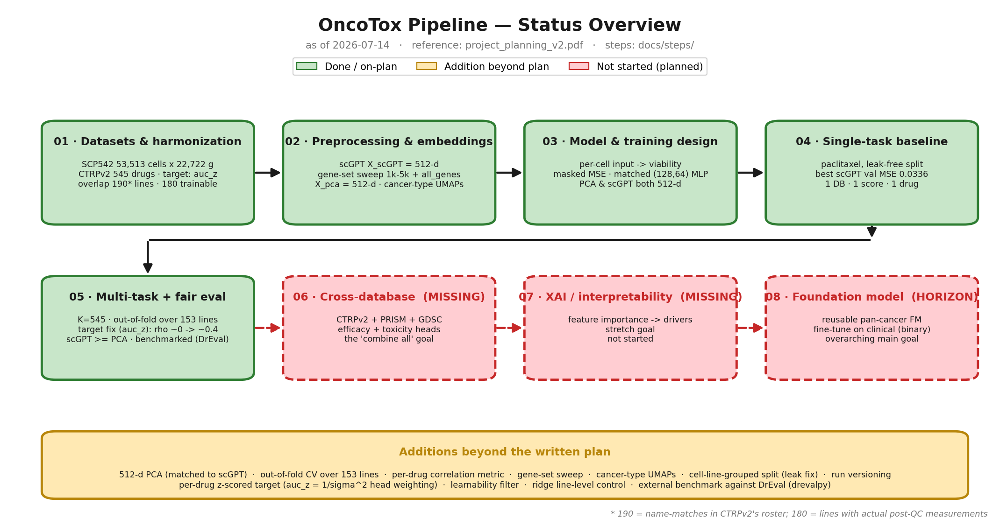

# OncoTox — Project Progress (index)

*Top-level index. The detailed, self-contained record is split into thematic step files under
[`docs/steps/`](./steps/) — this page holds the pipeline overview, the full project arc, the
current-status scorecard, and the doc-maintenance conventions. `project_notes.md` is a
complementary dated thought/decision log.*

Reference plan: `~/Desktop/OncoTox/project_plan/project_planning_v2.pdf`.
Plan-alignment is marked **✅ on-plan** or **⚠️ deviation/addition** inside each step file.

> ## 🔴 Read this before trusting any Step 04–05 number (13.07.2026)
>
> **The multi-task loss was unstandardized, and it was destroying the signal.** Steps 04–05 trained on
> `mean_pv`, whose per-drug variance is wildly heterogeneous. In a shared 545-head masked MSE, a minority
> of wide-spread drugs monopolize the trunk's gradient **because of their units, not their learnability**,
> and the model learns nothing that transfers.
>
> `notebooks/11_auc_vs_aucz.ipynb` **reproduces this failure on demand.** All three CTRPv2 targets, same
> model, same drugs, same split — out-of-fold Spearman on the 5 learnable drugs, scored on one common
> yardstick (the curve-fit AUC ranking), ±95% bootstrap CI over the ~150 held-out lines:
>
> | K=545 | `mean_pv` (Steps 04–05) | `auc` (curve fit) | **`auc_z`** (per-drug z) |
> |---|---|---|---|
> | `X_pca` | +0.027 [−0.04, 0.10] | +0.016 [−0.06, 0.09] | **+0.378** [0.31, 0.44] |
> | `X_scGPT` | **−0.070** [−0.14, 0.00] | **−0.087** [−0.15, −0.02] | **+0.430** [0.37, 0.48] |
>
> **The fix is the per-drug standardization — nothing else.** The curve fit buys **no accuracy**:
> `mean_pv` and raw `auc` are statistically identical at K=545 *and* at K=5 (where **all three targets
> tie**, ρ ≈ 0.42–0.49). Keep the curve fit for principled reasons (post-QC fit; the metric family GDSC2
> reports), not for performance.
>
> **Consequences — all four matter:**
>
> 1. **[Step 05](./steps/05-multitask-results.md)'s headline null result** ("neither rep ranks cell lines",
>    ρ ≈ 0 over 545 drugs) **was substantially an artifact** of this, *not* clean evidence about scGPT vs
>    PCA. The **8-run matrix conclusions rest on it and are suspect** — they need re-running on `auc_z`,
>    and should be expected to change, not merely refresh.
> 2. **Fixing the loss is the single biggest improvement the project has made.** Holding head count *and*
>    evaluation fixed, `mean_pv` → `auc_z` moved per-drug Spearman on the learnable drugs from **−0.29 to
>    +0.35** (scGPT). Drug filtering (+0.06) and honest out-of-fold measurement (+0.10) are real but
>    secondary.
> 3. **scGPT > PCA is now sign-consistent across 3 seeds** (gap **+0.075 ± 0.038** at K=545 `auc_z`) —
>    consistent evidence, **not** a proven margin. Needs more seeds and a wider drug set before it is a
>    headline claim.
> 4. **Model-side tuning is closed.** Regularization, capacity, batch size and reweighting are **all flat**
>    (`notebooks/10_ablations.ipynb`), and **`RidgeCV` on 150 cell-line mean embeddings ties the PCA MLP**
>    (ρ = 0.428) — so the entire deep single-cell apparatus currently buys **+0.06, and only for scGPT**.
>    Ridge-on-line-means, not the per-drug-mean null, is the baseline to beat from now on.
>
> **Scope reality check.** Everything trained so far is **one database, one response score** (CTRPv2). The
> 545-head "multi-task" run is multi-**drug**, *not* multi-database or multi-metric. The **ultimate goal is
> to combine all** — CTRPv2 + PRISM + GDSC, **efficacy and toxicity** — via cross-database masked
> multi-task ([Step 06](./steps/06-cross-database-integration.md)), then turn the result into a reusable
> foundation model fine-tunable on clinical outcomes
> ([Step 08](./steps/08-foundation-model-and-clinical-finetuning.md)). Don't read the current results as
> the finished goal.

---

## Pipeline overview (at a glance)



Green = done / on-plan · amber = addition or partial · red (dashed) = still missing.
Stages 1–6 are complete; the red boxes (cross-database PRISM/GDSC heads and the XAI stretch goal)
are the remaining work. Regenerate with `uv run docs/make_pipeline_overview.py`
(source: `docs/make_pipeline_overview.py`).

---

## The full project arc — document map

Each step is a self-contained file. **Steps 01–05 are done; 06–08 are placeholders** for planned
work, kept here so the entire project structure is visible end-to-end.

| Step | Status | What it covers |
|---|---|---|
| **[01 — Datasets & harmonization](./steps/01-datasets-and-harmonization.md)** | ✅ Done | Raw datasets (SCP542, CTRPv2, PRISM, GDSC), overlap/coverage audit, drug catalog, cell-line & compound harmonization. |
| **[02 — Preprocessing & embeddings](./steps/02-preprocessing-and-embeddings.md)** | ✅ Done | AnnData build, scGPT embeddings, UMAP latent validation, HVG-5000, `all_genes` variant, on-disk layout, reproduce commands. |
| **[03 — Model & training design](./steps/03-model-and-training-design.md)** | ✅ Done | Exact input/output/target/mask of a training example, MSE definition, **supervised** training paradigm. |
| **[04 — Single-task results](./steps/04-single-task-results.md)** | ✅ Done | Paclitaxel baseline + data-leak fix. **1 database, 1 score, 1 drug.** |
| **[05 — Multi-task results & versioning](./steps/05-multitask-results.md)** | ✅ Done | Masked-loss across 545 CTRPv2 drugs + run ledger. **Still 1 database, 1 score; multi-*drug* only.** |
| **[06 — Cross-database integration](./steps/06-cross-database-integration.md)** | ❌ Not started | **The "combine all" goal:** CTRPv2 + PRISM + GDSC, efficacy + toxicity, cross-database masked multi-task. |
| **[07 — XAI / feature interpretability](./steps/07-xai-feature-interpretability.md)** | ❌ Not started | Stretch goal: feature importance → transcriptomic drivers of resistance. |
| **[08 — Foundation model & clinical fine-tuning](./steps/08-foundation-model-and-clinical-finetuning.md)** | ❌ Not started | Overarching goal: reusable pan-cancer foundation model, fine-tunable on clinical (binary) outcomes. |

**Where this is going (the two axes that widen):**

```
Step 04   1 database · 1 score · 1 drug        (CTRPv2, paclitaxel)
Step 05   1 database · 1 score · K=545 drugs   (CTRPv2, all drugs)              ← here now
Step 06   3 databases · 2 metric types         (CTRPv2+PRISM+GDSC, efficacy+toxicity)
Step 08   + clinical fine-tuning               (continuous pre-train → binary clinical head)
```

**Fast facts you'll want regardless of which step you open** (full detail in
[Step 03](./steps/03-model-and-training-design.md)):

- A training example = **one single cell**; input = a 512-dim scGPT embedding (`X_scGPT`) or PCA
  (`X_pca`). Cell line / cancer type / drug are **not** input features.
- Target = a CTRPv2 response score chosen with `--score`, defined per **(cell line × drug)** and
  broadcast to every cell of that line. Default **`auc_z`** = per-drug z-scored, grid-normalized
  AUC (13.07.2026), so **MSE ≈ 1.0 means "no better than the drug's mean"**. The legacy `mean_pv`
  (viability, clusters near 1.0, MSE ≈ 0.01 looks tiny but is meaningless) still backs Steps 04–05.
- Training is **fully supervised regression** (masked MSE/Huber). scGPT is a **frozen** self-supervised
  feature prior; the mask handles label sparsity but does **not** make it semi-supervised.

---

## Experiment matrix — PCA vs scGPT

The central comparison (the plan's core hypothesis) is run as a **2 × 2 × 2 = 8-run matrix**.
All eight runs share the cell-line-grouped split and a **matched trunk** `(128,64)` (set 14.06.2026)
+ identical training protocol; only the input representation (and its gene set) changes.

| Axis | Values |
|---|---|
| **Gene set** | `all_genes` (full transcriptome) · `hvg5000` (top-5,000 HVG from raw) |
| **Representation** | `X_pca` (standard single-cell PCA baseline, **512-d** to match scGPT) · `X_scGPT` (512-d embedding) |
| **Task** | single-task (paclitaxel) · multi-task (all drugs, K = 545) |

**Genes per condition** — PCA uses the full filtered set; scGPT uses only its in-vocabulary subset.
This OOV gap is **intentional** (scGPT's vocabulary coverage is part of the model — see
[Step 02](./steps/02-preprocessing-and-embeddings.md)):

| Gene set | PCA genes | scGPT genes (in-vocab) |
|---|---|---|
| `all_genes` | 22,722 | 20,570 |
| `hvg5000` | 5,000 | 4,576 |

**Result (matched trunk + matched 512-d width, 27.06.2026):** scGPT **overfits far less** —
`hvg5000` single-task train/val gap **0.004 (scGPT) vs 0.033 (PCA)** — but does **not** beat PCA on
raw accuracy: on all-drugs PCA leads on heads-beating (`hvg5000` **169 vs 147**, `all_genes` **138 vs
131**), val MSEs within 0.0003. So the representation mainly affects *generalization*, not predictive
power — and this now holds with input dimensionality matched, so it is **not** a capacity artifact.

Results: [Step 04](./steps/04-single-task-results.md) (single-task), [Step 05](./steps/05-multitask-results.md)
(multi-task); per-drug coverage & learnability in `notebooks/04_drug_coverage.ipynb`. Action list:
[TODO.md](./TODO.md).

> **PCA width matched to scGPT (27.06.2026).** The original matrix used a **~50-d** PCA (scanpy
> default) + a smaller `(64,32)` PCA trunk, both of which handicapped PCA. PCA now keeps **512
> components** (`add_pca.DEFAULT_N_COMPS`, override `--pca-n-comps`) on the matched `(128,64)` trunk,
> so PCA and scGPT share input width *and* parameter count — the last comparison confound is closed.
> The **full 8-run matrix was re-run at 512-d** (reproducible in `notebooks/07_training.ipynb`; run
> dirs `runs/20260627_1913xx_*`); the numbers above and in [Step 05](./steps/05-multitask-results.md)
> are these 512-d results and supersede the 14.06 (~50-d) matrix.

---

## Where everything is saved (file map)

Data root: `DEFAULT_DATA_ROOT = /Users/selin/Desktop/OncoTox/data` (override with `--data-root`).
Each gene-set variant has its own folder `processed/scRNAseq_SCP542/<variant>/` holding three h5ad
files in pipeline order. **There is no separate file per representation, per drug, or per task** —
one trainable file per variant bundles everything, and the representation / drug / task are
*selected at training time*, not stored as separate files.

**Raw inputs** (shared, not per-variant):
- scRNA-seq counts → `data/scRNAseq_SCP542/expression/CPM_data.txt`
- cell metadata → `data/scRNAseq_SCP542/metadata/Metadata.txt`
- CTRPv2 tables → `data/metadata/CTRPv2.0_2015_ctd2_ExpandedDataset/v20.*`

**Exact location of each artifact** (paths under `processed/scRNAseq_SCP542/`):

| Artifact | HVG filtered? | File | Stored as | Shape / genes |
|---|---|---|---|---|
| Counts (CPM) | **filtered** | `hvg5000/SCP542_CCLE.h5ad` | `.X` | 53,513 × 5,000 |
| Counts (CPM) | **non-filtered** | `all_genes/SCP542_CCLE.h5ad` | `.X` | 53,513 × 22,722 |
| **scGPT embeddings — filtered HVG** | **filtered** | `hvg5000/SCP542_CCLE_scGPT_human_embeddings.h5ad` | `obsm["X_scGPT"]` | 53,513 × 512 (from 4,576 in-vocab genes) |
| **scGPT embeddings — non-filtered** | **non-filtered** | `all_genes/SCP542_CCLE_scGPT_human_embeddings.h5ad` | `obsm["X_scGPT"]` | 53,513 × 512 (from 20,570 in-vocab genes) |
| **PCA — filtered HVG** | **filtered** | `hvg5000/…_with_targets_auc_z.h5ad` | `obsm["X_pca"]` | 53,513 × **512** (computed on the 5,000 HVG; matches scGPT width) |
| **PCA — non-filtered** | **non-filtered** | `all_genes/…_with_targets_auc_z.h5ad` | `obsm["X_pca"]` | 53,513 × **512** (computed on all 22,722; matches scGPT width) |
| Drug labels — **all 545 drugs** | both | `<variant>/…_with_targets_auc_z.h5ad` | `obsm["Y_ctrp"]` (+ `obsm["M_ctrp"]`, `uns["ctrp_drugs"]`, `uns["ctrp_score"]`) | 53,513 × 545 |
| Drug labels — **one drug (paclitaxel)** | both | same targets file | one column of `Y_ctrp` selected via `--drugs paclitaxel`; legacy `obs["viability_paclitaxel"]` | 53,513 × 1 |
| Split — shared, cell-line-grouped | both | same targets file | `obs["split_ctrp"]` | per-cell |
| Split — paclitaxel-only (legacy) | both | same targets file | `obs["split_paclitaxel"]` | per-cell |

**The trainable file** is `<variant>/SCP542_CCLE_scGPT_human_embeddings_with_targets[_<score>].h5ad` —
the only file passed to training. It contains, together: `X_scGPT`, `X_pca`, `Y_ctrp`, `M_ctrp`,
`split_ctrp`, `split_paclitaxel`, `viability_paclitaxel`, and `uns["ctrp_drugs"]`. **One file per
target score**, so scores can be compared without rebuilding the shared convert/scGPT outputs; the
Step 04–05 runs read the legacy un-suffixed (`mean_pv`) file.

**How the runs select from these files** (no new files are written for a run's inputs):
- gene set → `--variant {hvg5000, all_genes}` (which folder)
- target score → `--score {auc_z, auc, mean_pv}` (which targets file in that folder)
- representation → `--use-rep {X_scGPT, X_pca}` (which `obsm` key)
- task → `--drugs paclitaxel` (one drug) vs omitted (all 545)

**Training outputs:** each run writes `runs/<timestamp>_<tag>/` (gitignored) with `best_model.pt`,
`config.json`, `run_meta.json` (records the variant via the targets path), `history.csv`,
`summary.json`, `per_drug_results.csv`; one index row per run in `runs/runs_index.csv`.

---

## Notebooks (`notebooks/`, pipeline order)

Notebooks are **numbered in workflow order** so the pipeline reads top-to-bottom. All notebook figures
and tables are written to **`notebooks/outputs/`** (kept out of the notebook root). Per-notebook detail
and the reproduce order live in [`notebooks/README.md`](../notebooks/README.md).

**Only two notebooks are on the results critical path:** `05_preprocessing` (builds the trainable data)
and `07_training` (all model results). Run **05 → 07** to reproduce everything. The rest
(`01/02/03/04/06`) are **exploration / harmonization / QC** — they shaped design decisions and help
interpret results but are **not required** to get the numbers (the preprocessing/training scripts don't
read any of their outputs).

| # | Notebook | Role | Needed for results? |
|---|---|---|---|
| 01 | `01_scDAExploration.ipynb` | Initial single-cell (SCP542) data exploration | No — exploration |
| 02 | `02_compare_GDSC_CTRP.ipynb` | Cross-database drug-catalog harmonization (CTRP/GDSC/DrugBank → `data/drug/*`) | No — one-off |
| 03 | `03_analysis.ipynb` | CTRP→PRISM drug-repurposing / clinical-phase mapping | No — metadata |
| 04 | `04_drug_coverage.ipynb` | Per-drug coverage & learnability (→ `outputs/*_drug_learnability.csv`, `outputs/drug_coverage.png`) | No — informs interpretation |
| **05** | **`05_preprocessing.ipynb`** | Front-end to `run_preprocessing.py`: §A recompute 512-d `X_pca` (both variants); §B build the HVG-sweep variants (gated, scGPT re-embed) | **Yes — data** |
| 06 | `06_verify_variants.ipynb` | QC audit of `hvg5000` vs `all_genes` outputs; PCA-vs-scGPT UMAPs (→ `outputs/variants.png`) | No — validation/QC |
| **07** | **`07_training.ipynb`** | §1 8-run matrix (load-or-train) · §2 GroupKFold CV (test held out, mean±std incl. Δmse) · §3 per-drug correlation · §4 HVG sweet spot. Caching flags `RETRAIN_MATRIX`/`RECOMPUTE_CV`/`RECOMPUTE_SWEEP` | **Yes — results** |

`05_preprocessing.ipynb` and `07_training.ipynb` both call the **same script entry points** the CLI
uses (`run_preprocessing.py`, `train_multitask.train_rep` / `cv_evaluate`), so the notebooks and command
line cannot drift — they are documentation *and* a re-run, not a fork.

---

## Figures & evaluation outputs (catalog)

Every plot and evaluation artifact produced so far, with what it shows, the headline numbers, and the
doc/notebook that owns the authoritative discussion. **All files live in `notebooks/outputs/`.**
Regenerate by re-running the source notebook (see the table above); the **numbers** are owned by the
step files (mainly [Step 05](./steps/05-multitask-results.md)) — this catalog is a map, not a second
source of truth.

**Figures (`.png`):**

| Figure | What it shows | Headline | Source · backs |
|---|---|---|---|
| `target_distribution.png` | 4-panel "why the task is hard": **A** viability histogram, **B** per-drug response-std histogram, **C** coverage-vs-std filter scatter, **D** per-drug response bands | A: clusters near 1.0 (median **0.91**, 75% ≥ 0.8); B: median per-drug std **0.088**, only **3%** flat; C: filter (cov ≥ 100 & std ≥ 0.05) keeps **439/545**; D: responses squeezed into ~0.8–1.0 | `04_drug_coverage.ipynb` · Step 05 learnability |
| `drug_coverage.png` | Per-drug coverage (# cell lines) and response variance | No drug covers all 180 lines (max 179, median 171); 382 drugs ≥ 90% coverage | `04_drug_coverage.ipynb` |
| `per_drug_correlation_cdf.png` | CDF of **per-drug Spearman** (pred vs true across held-out lines), PCA vs scGPT, 461 real-variance drugs | Curves sit on 0: mean Spearman **−0.02 (PCA) / −0.05 (scGPT)**; only ~4% of drugs ρ > 0.3 → model does **not** rank cell lines | `07_training.ipynb` §3 · Step 05 "Better metric" |
| `per_drug_scatter_pca_vs_scgpt.png` | Per-drug Spearman PCA vs scGPT, point per drug | Both clustered around 0; no rep systematically ranks better | `07_training.ipynb` §3 |
| `hvg_sweep_curve.png` | Heads-beating-baseline vs gene-set size (1k→all genes), 5-fold CV | **Flat** for both (PCA ~203–216, scGPT ~184–193); no sweet spot, all-genes no better than HVG | `07_training.ipynb` §4 · Step 05 "Gene-set sweep" |
| `training_curves_pca_vs_scgpt.png` | Train/val MSE vs epoch, PCA vs scGPT (the overfitting gap) | `hvg5000` single-task gap **0.004 (scGPT) vs 0.033 (PCA)** | `07_training.ipynb` §1 · Step 05 single-task |
| `umap_cancertype_pca_vs_scgpt.png` | Latent-space UMAP coloured by cancer type, PCA vs scGPT | scGPT mixes tissues; PCA keeps tissue-of-origin islands (latent validation) | `06_verify_variants.ipynb` · Step 02 |
| `umap_sweep_cancertype.png` | UMAP by cancer type across gene-set variants | Latent structure stable across HVG counts | `06_verify_variants.ipynb` |
| `variants.png` | QC PCA-vs-scGPT UMAP for `hvg5000` vs `all_genes` | Variant outputs agree (sanity QC) | `06_verify_variants.ipynb` · Step 02 |

**Evaluation tables (`.csv`):**

| Table | Contents |
|---|---|
| `cv_summary.csv` / `cv_folds.csv` | 5-fold GroupKFold CV (test held out): heads-beating, **Δmse**, all-drugs val MSE, paclitaxel gap — per rep (summary) and per fold (with `median_delta`, `frac_beat`) |
| `per_drug_correlation_summary.csv` | Per-rep mean/median Spearman, mean Pearson, frac ρ > 0.3 over 461 drugs |
| `per_drug_correlation_X_pca.csv` / `…_X_scGPT.csv` / `per_drug_pca_vs_scgpt.csv` | Per-drug correlation values (and the PCA-vs-scGPT join) |
| `hvg_sweep.csv` | Gene-set sweep: heads-beat mean/std, Δmse mean/std, val MSE per (variant × rep) |
| `matrix_all_drugs.csv` / `matrix_single_paclitaxel.csv` | The 8-run matrix results (all-drugs / single-task paclitaxel) |
| `training_pca_vs_scgpt_summary.csv` | Single-split per-rep summary (best val MSE, epoch, model vs baseline mean MSE, heads-beating, run dir) |
| `ctrp_drug_learnability.csv` / `gdsc_drug_learnability.csv` | Per-drug coverage + response-variance learnability scores |

---

## The plan (for reference)

A staged prototype (from the plan PDF):

1. **Latent-space validation** — generate scGPT embeddings, compare to full-transcriptome
   PCA via UMAP (Fig. 3 by cancer type, Fig. 4 by paclitaxel viability); confirm scGPT
   removes tissue-of-origin bias.
2. **Single-task baseline** — regress the continuous CTRPv2 response
   score from the embeddings on the **highest-confidence intersection** SCP542×CTRPv2
   (**190 cell lines, 545 compounds, 100 % non-null in overlap**). *Do not start
   multi-task / PRISM / GDSC until this works.*
3. **Iterate outward** — add masked-loss multi-task and integrate the larger, sparser
   PRISM (and GDSC) datasets — efficacy **and** toxicity.
4. **Stretch goal** — XAI / feature importance.

Overarching main goal: a reusable pan-cancer single-cell **foundation model** fine-tunable for
specific cancer types / clinical (binary) datasets.

**Core hypothesis:** scGPT embeddings are a denoised biological prior that forces the
regressor to learn real resistance signatures instead of memorizing cell line / tissue
identity → should show as **less overfitting (smaller train/val gap) for scGPT than PCA**.

---

## Current status — plan vs. reality

| Plan item | Status | Evidence |
|---|---|---|
| Sub-goal 1: compound harmonization (names + BRD + DrugBank) | ✅ Done | [Step 01](./steps/01-datasets-and-harmonization.md) |
| Sub-goal 2: masked-loss sparsity handling | ✅ Done (intra-CTRPv2) | [Step 05](./steps/05-multitask-results.md) |
| Sub-goal 3: baseline on SCP542×CTRPv2 highest-confidence intersection | ✅ Done | [Step 04](./steps/04-single-task-results.md)–[05](./steps/05-multitask-results.md) |
| Phase 1: scGPT embeddings + UMAP latent validation | ✅ Done | [Step 02](./steps/02-preprocessing-and-embeddings.md); Fig. 3/4 |
| Phase 2: single-task continuous regression | ✅ Done (on legacy `mean_pv`) | best scGPT val **0.0336** ([Step 04](./steps/04-single-task-results.md)) |
| Target score: curve-fit AUC instead of dose-averaged viability | ✅ Done 13.07.2026, **re-runs pending** | `--score auc_z` default ([Step 03](./steps/03-model-and-training-design.md)); Steps 04–05 numbers still `mean_pv` |
| Core hypothesis: scGPT overfits less than PCA | ✅ Confirmed (generalization only) | 512-d matched: `hvg5000` single-task gap 0.004 (scGPT) vs 0.033 (PCA); but PCA ≈/better on all-drugs accuracy (169 vs 147) ([Step 05](./steps/05-multitask-results.md)) |
| Does the model rank cell lines at all? | ✅ **Yes** (13.07.2026) | **0.43 (PCA) / 0.49 (scGPT)** out-of-fold on the 5 learnable drugs — and **0.38 / 0.43 even at K=545** once the target is z-scored. The old ρ ≈ 0 was an unstandardized-loss + unlearnable-drug artifact ([Step 05](./steps/05-multitask-results.md)) |
| Is the per-drug z-scoring load-bearing? | ✅ **Yes — it is the whole effect** (13.07.2026) | K=545: `mean_pv` −0.070 / `auc` −0.087 / **`auc_z` +0.430** (scGPT). At K=5 all three tie. The **curve fit buys no accuracy**; the standardization does everything (`notebooks/11`) |
| Is scGPT's lead over PCA real? | 🟡 **Sign-consistent over 3 seeds** (13.07.2026) | K=545 `auc_z` gap **+0.075 ± 0.038** (seeds 42/1/7, all positive). Consistent evidence, **not** a proven margin — needs more seeds + a wider drug set |
| Is the model over-regularized / too big? | ❌ **No — tuning is closed** (13.07.2026) | Regularization, capacity (74,629→2,565 params), batch size, reweighting: **all flat**. **Ridge on 150 line-means ties the PCA MLP** (0.428) → the deep pipeline buys +0.06, scGPT only (`notebooks/10_ablations.ipynb`) |
| 8-run matrix conclusions (`mean_pv`) | ⚠️ **Suspect — re-run required** | They rest on the K=545 null result, which the unstandardized loss substantially produced. Re-run on `--score auc_z` ([TODO](./TODO.md)) |
| Phase 3a: multi-task masked loss | ✅ Done **within CTRPv2 only** | [Step 05](./steps/05-multitask-results.md) |
| Phase 3b: integrate PRISM / GDSC (cross-database, efficacy+toxicity) | ❌ Not started | data downloaded + harmonized only ([Step 06](./steps/06-cross-database-integration.md)) |
| Stretch: XAI / feature importance | ❌ Not started | [Step 07](./steps/07-xai-feature-interpretability.md) |
| Main goal: foundation model + clinical fine-tuning | ❌ Not started (horizon) | [Step 08](./steps/08-foundation-model-and-clinical-finetuning.md) |

**Additions beyond the written plan (all defensible — document them):** random→leak→grouped
split ([Step 04](./steps/04-single-task-results.md)); HVG-5000 + all-genes comparison
([Step 02](./steps/02-preprocessing-and-embeddings.md)); per-drug-mean sanity baseline +
run-versioning ledger ([Step 05](./steps/05-multitask-results.md)); **512-d PCA** (input width
matched to scGPT, removing the dimensionality confound — [Step 05](./steps/05-multitask-results.md));
**reproducible preprocessing/training notebooks** (`notebooks/05_preprocessing.ipynb`,
`notebooks/07_training.ipynb`).

**Two things to flag clearly in the writeup:**

1. **Multi-task today = 545 CTRPv2 drugs, not CTRPv2+PRISM+GDSC** — plan-Phase-3 half done
   (the real "combine all" is [Step 06](./steps/06-cross-database-integration.md)).
2. **Cell-line overlap: 190 vs 180** — 190 = name matches in CTRPv2's roster; 180 = lines with
   actual post-QC measurements (10 listed-but-unscreened lines drop out). It's **data availability,
   not normalization** (verified 14.06). Use 180 (the trainable set).

---

## Open questions carried forward

*Action items live in [TODO.md](./TODO.md); this list is the scientific open questions.*

- Does multi-task help or hurt paclitaxel? Single-task on `split_ctrp` now exists (scGPT 0.0406,
  PCA 0.0372 on `hvg5000`); compare against the paclitaxel **head** inside the K=545 run
  ([Step 05](./steps/05-multitask-results.md)).
- Which low-coverage heads to drop or down-weight? (Quantified in `notebooks/04_drug_coverage.ipynb`:
  the ≈16-line drugs, n_val 221, are the unreliable/hardest heads.)
- Move loss from uniform-per-entry to per-head / uncertainty weighting?
- Does HVG-5000 lose signal vs the full transcriptome? (Compare the variants in
  `06_verify_variants.ipynb`.)
- When to integrate PRISM/GDSC as additional masked heads (the true Phase-3,
  [Step 06](./steps/06-cross-database-integration.md))?

---

## Maintaining these docs (conventions)

- **Source of truth = this index + [`steps/`](./steps/).** Together they must hold **all**
  important steps, numbers, parameters, and results, so everything is derivable from these files
  alone. `project_notes.md` is a dated thought/decision log — an *addition*, not the primary
  record; mine it for context but put authoritative numbers here.
- **When new work lands:** update the relevant **step file** with the hard details (cell/gene
  counts, split distributions, hyperparameters, run IDs, MSEs, deviations), then refresh the
  **scorecard + arc** above if the plan-vs-reality picture changed. Each step carries its own
  ✅ on-plan / ⚠️ deviation callouts against the plan PDF.
- **Keep numbers consistent** between this index, the step files, and `project_notes.md`.
- **190 vs 180 cell-line overlap — resolved (14.06):** it is **not** a normalization difference
  (both rules give 190). **190** = SCP542 names found in CTRPv2's cell-line *roster*; **180** = those
  with actual **post-QC viability measurements**. The 10-line gap is unscreened lines (no labels):
  `abc1, hs939t, jhh7, mdamb436, mfe280, ncih1048, ncih2073, ncih2347, rerflckj, ten`. Use **180**
  (the trainable set); 190 is the roster count ([Step 01](./steps/01-datasets-and-harmonization.md)).
